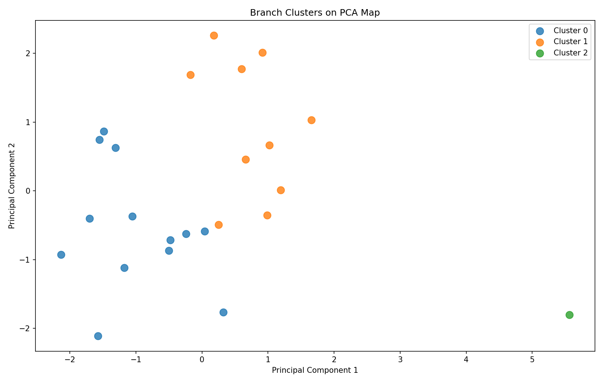
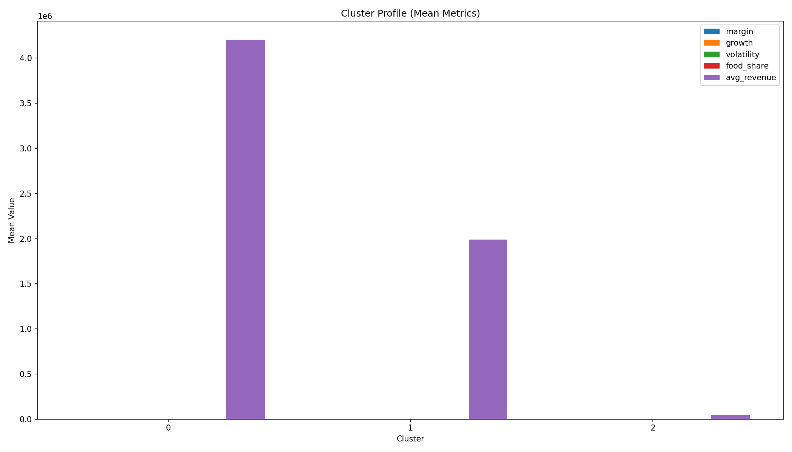
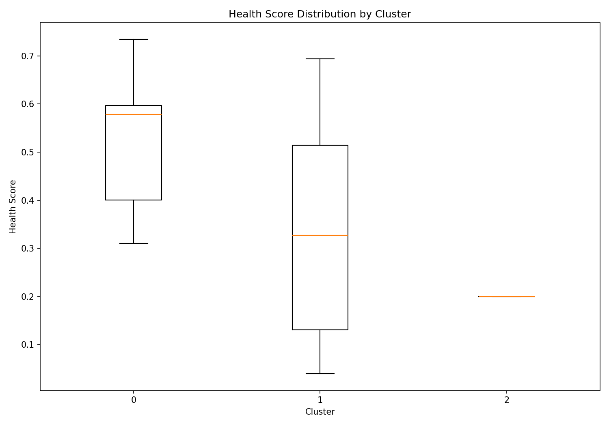
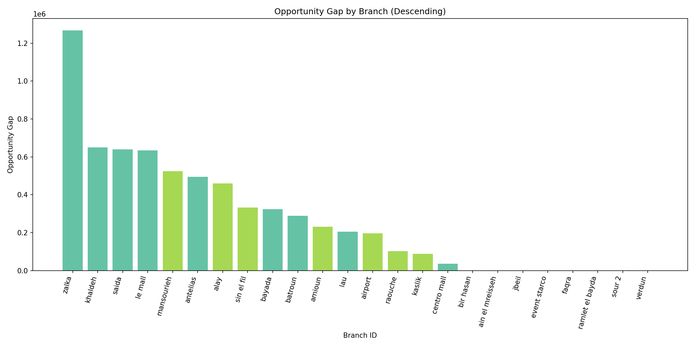

# Branch Performance Intelligence Dashboard (Clustering + Health + Opportunity Gap + Bundling)

A lightweight decision dashboard that groups branches by **structural behavior**, benchmarks performance **within peer clusters**, quantifies **profit opportunity gap**, and recommends **profit-safe bundles** to move low-selling/low-profit items.

---

## Business Problem
Leadership needs to answer:
1) **Which branches are underperforming vs comparable peers?**  
2) **How much profit is being left on the table (gap-to-best)?**  
3) **Which low-selling items can be promoted without losing money (bundles)?**

---

## Approach & Methodology
### 1) Structural Clustering (Branch Personas)
We engineer behavior-based features (size-invariant): margin %, product mix, growth, volatility, etc.  
Standardize features → **KMeans** (k≈3–4) → clusters = branch personas.

### 2) Health Score (within cluster)
Composite score (normalized within cluster), e.g. margin + growth + stability + revenue.

### 3) Gap-to-Best-in-Cluster (Opportunity)
Benchmark each branch against the top peer in its cluster:  
**Gap = Potential Profit − Actual Profit**

### 4) Bundle Recommender (New)
For each branch:
- detect **low-selling / low-profit items**
- pick strong **anchor** items
- propose **bundle price + discount** such that **bundle profit remains positive** and meets a target margin  
Uses transaction co-occurrence if available; otherwise a lightweight fallback.

---

## Key Outputs
- `data/processed/branches_scored.csv` — cluster, health score, gap per branch  
- `data/processed/branch_monthly.csv` — time series for branch drilldown  
- `data/processed/bundles.csv` — bundle suggestions per branch

---

## Key Findings & Visualizations

**Clustering results (reports/figures):**

1) **PCA Cluster Map** — how branches separate in 2D embedding  


2) **Cluster Profile** — average behavioral signature per cluster (persona view)  


3) **Health Score Distribution** — spread of performance within peer groups  


4) **Opportunity Gap (Bar)** — where unrealized profit is concentrated  


## How to Run (Local)
### 1) Setup
```bash
python -m venv .venv
source .venv/bin/activate
pip install -r requirements.txt